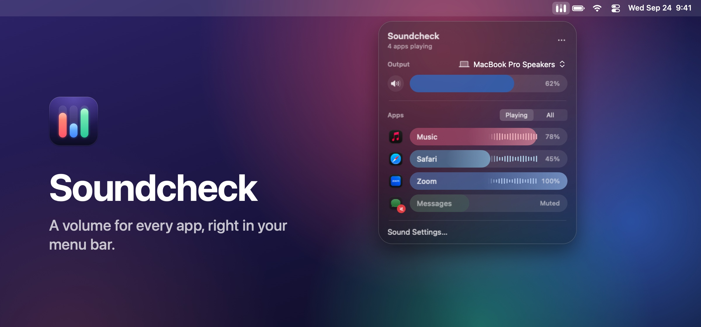

<p align="center">
  
</p>

# Soundcheck

Soundcheck gives every app on your Mac its own volume. Keep your music up while a video call stays quieter, or mute one app completely, right from the menu bar.

- Set any app from 0 to 100 percent of its own volume, or mute it with one click.
- See which apps are playing, with live level bars on each app's slider.
- Soundcheck remembers each app's volume, including new windows and helper processes, and after you quit and reopen the app.
- Choose your output device and set its volume in the same panel.
- Soundcheck lives in the menu bar, with no Dock icon or app window.

## Requirements

- A Mac with Apple silicon
- macOS Tahoe 26 or later
- To build Soundcheck: Xcode 26 or later and [XcodeGen](https://github.com/yonaskolb/XcodeGen)

## Install Soundcheck

Soundcheck isn't available on the App Store, so you build it from this repository.

1. Install Xcode from the App Store, then open it once so it can finish installing its components.
2. Install XcodeGen. If you use [Homebrew](https://brew.sh), open Terminal and enter:

   ```sh
   brew install xcodegen
   ```

3. Get the code. In Terminal, enter:

   ```sh
   git clone https://github.com/ishuagrawal/soundcheck.git
   cd soundcheck
   ```

   You can also click **Code** > **Download ZIP** on this page, unzip the file, then go to its folder in Terminal.
4. Build the app:

   ```sh
   ./scripts/build.sh
   ```

   When the build finishes, Terminal shows the location of `Soundcheck.app`, in the `build` folder.
5. In the Finder, drag **Soundcheck** from the `build` folder to your Applications folder.
6. Open Soundcheck from your Applications folder. The Soundcheck icon, three small sliders, appears in the menu bar.

## Set up Soundcheck

Soundcheck needs your permission to access audio from other apps before it can change their volume.

1. Click the Soundcheck icon in the menu bar.
2. Click **Enable App Volume**.
3. When macOS asks for permission to access audio from other apps, click **Allow**.

Soundcheck uses app audio only to measure its level and change its volume, live on your Mac. It never records audio, saves it to disk, or sends it anywhere, and it doesn't ask for access to your microphone or screen.

## Use Soundcheck

Click the Soundcheck icon in the menu bar to open the panel. To close it, click anywhere outside the panel or press Esc.

### Change an app's volume

Drag the app's slider. At 100 percent, an app plays at its own volume; lower settings make it quieter. Soundcheck can't make an app louder than its own volume.

### Mute or unmute an app

Click the app's icon to the left of its slider. A muted app shows a red badge, and its slider stays dimmed at its saved level. To unmute, click the icon again or drag the slider.

You can also Control-click an app's slider and choose **Mute** or **Unmute**.

### Reset an app to its own volume

Control-click the app's slider, then choose **Reset to 100%**.

### Show every app

The panel shows apps that are playing sound, plus any app whose volume you changed. To see every open app, click **All** above the list. Click **Playing** to return to the shorter list.

### Change the output device or its volume

- To choose where sound plays, click the device name next to **Output**, then choose a device.
- To change the device's volume, drag the **Output** slider.
- To mute the device, click the speaker button next to the slider.
- To open Sound settings, click **Sound Settings** at the bottom of the panel.

Some devices, like certain displays and audio interfaces, control volume only with their own buttons. For these devices, the panel shows “Use your device’s own volume controls” instead of a slider.

### Pause Soundcheck or reset all apps

Click the More button (**…**) in the panel, then choose one of these options:

- **Pause App Volume**: Every app plays at its own volume until you choose **Resume App Volume**. Your saved settings aren't changed.
- **Reset All Apps**: Every app returns to 100 percent and is unmuted.

### Open Soundcheck when you log in

Click the More button (**…**), then choose **Launch at Login**.

### Quit Soundcheck

Click the More button (**…**), then choose **Quit Soundcheck**. When you quit, every app returns to its own volume. Your settings are applied again the next time you open Soundcheck.

## If you need help

**An app isn't in the list.** Apps appear in the list when they play sound. To find an app that isn't playing, click **All**.

**An app's volume doesn't change, or it shows a warning symbol.** Make sure Soundcheck has permission to access audio. Click the More button (**…**), choose **Audio Access**, then make sure Soundcheck is turned on. Then quit Soundcheck and open it again.

**macOS asks for audio access again.** Each build of Soundcheck is signed on your Mac, so rebuilding or moving the app can make macOS ask again. Click **Allow**.

**macOS says Soundcheck can't be opened.** This can happen if someone sent you Soundcheck as a ZIP file instead of you building it. Choose Apple menu > System Settings, then click **Privacy & Security** in the sidebar. Scroll down, then click **Open Anyway** next to the message about Soundcheck. Open Soundcheck only if you trust the person who sent it.

## Uninstall Soundcheck

1. If **Launch at Login** is turned on, click the More button (**…**) and turn it off.
2. To also remove Soundcheck's audio permission, click the More button (**…**), then choose **Audio Access**. In the settings that open, select Soundcheck, then click the Remove button (**–**).
3. Quit Soundcheck.
4. Drag Soundcheck from your Applications folder to the Trash.
5. To also remove your saved app volumes, open Terminal and enter:

   ```sh
   defaults delete com.ishu.Soundcheck
   ```

## Known limitations

- Soundcheck can't control audio that started before Soundcheck opened.
- Some apps play sound through a shared system service, and that sound can't always be matched to the right app.
- Live volume and mute checks have passed with a virtual output device. Other setups, including Bluetooth device changes, multichannel hardware, protected (DRM) playback, and long sleep and wake periods, haven't all been tested.
- If Soundcheck can't control an app's audio format or route, it shows a warning and the app keeps playing at its own volume.

## Development

### Set up the repository

1. Install Xcode 26 or later and XcodeGen, as described in [Install Soundcheck](#install-soundcheck).
2. Clone the repository and run the tests:

   ```sh
   git clone https://github.com/ishuagrawal/soundcheck.git
   cd soundcheck
   ./scripts/test.sh
   ```

3. To work in Xcode, generate the project, then open it:

   ```sh
   xcodegen generate
   open Soundcheck.xcodeproj
   ```

   Edit `project.yml`, not the generated project, to change targets or build settings, then run `xcodegen generate` again.

### Build and test

```sh
./scripts/build.sh       # Release build, plus build/Soundcheck.zip
./scripts/build.sh run   # Build, then open the app
./scripts/test.sh        # Audio kernel sanitizer tests and unit tests
```

Builds target arm64 only; the build script checks that the app contains no Intel code. `project.yml` is the source of truth for the Xcode project. `Soundcheck.xcodeproj` isn't committed: the scripts generate it, or run `xcodegen generate` to open it in Xcode. Derived data goes to `/tmp/soundcheck-derived`, because iCloud-synced folders can add Finder metadata that breaks code signing. Set `SOUNDCHECK_BUILD_DIR` to use another location.

Builds are signed locally. To distribute Soundcheck, sign it with your own Developer ID and notarize it.

### How it works

Soundcheck finds apps through public Core Audio process objects and `NSWorkspace`. Each app you adjust gets a private process tap and aggregate device for each output device and stream. A muted app uses a tap-only reader, so no silent audio plays through the hardware. Taps use `mutedWhenTapped`: Core Audio silences the original only while the reader runs. A small C callback copies Float32 audio with an atomic gain target and a 5 ms ramp; it doesn't allocate memory, take locks, or call Swift on the audio thread.

An app at 100 percent keeps its original output path. While the panel is open, metering taps collect peak levels for the level bars; they close when the panel closes. Pausing, resetting, a startup failure, or quitting removes the affected routes. No kernel extension, audio driver, private privacy API, or third-party package is installed.

Settings and each app's known helper bundle identifiers are stored locally. Bundle matching is exact and limited to identifiers in the app's own namespace, so shared identifiers like WebKit's aren't claimed for every app. New helpers are matched to their app by the app bundle that contains them, or by a short walk up their parent processes.

### Diagnostics and tools

- Open Soundcheck with `--diagnostics /tmp/soundcheck-audio.json` to export control state, process object IDs, callback counts, and peak levels. It's opt-in and never exports audio.
- `scripts/audio-inventory.swift` and `scripts/tone-fixture.swift` support manual integration checks. The tone fixture plays a quiet tone and exits after 90 seconds; run two copies with the same bundle ID to simulate an app opening new windows or helpers.
- `scripts/make-icon.swift` regenerates the app icon.
- To regenerate the image at the top of this page, render the panel, then composite it:

  ```sh
  xcodegen generate
  mkdir -p /tmp/soundcheck-snapshots
  TEST_RUNNER_SOUNDCHECK_SNAPSHOT_DIR=/tmp/soundcheck-snapshots xcodebuild -project Soundcheck.xcodeproj -scheme Soundcheck \
    -destination 'platform=macOS,arch=arm64' test -only-testing:SoundcheckTests/PanelSnapshotTests
  swift scripts/make-readme-image.swift /tmp/soundcheck-snapshots/mixer-dark-clear@2x.png \
    Soundcheck/Resources/Assets.xcassets/AppIcon.appiconset/soundcheck-512@2x.png assets/soundcheck.jpg
  ```

## License

Soundcheck is available under the MIT license. See [LICENSE](LICENSE) for details.
